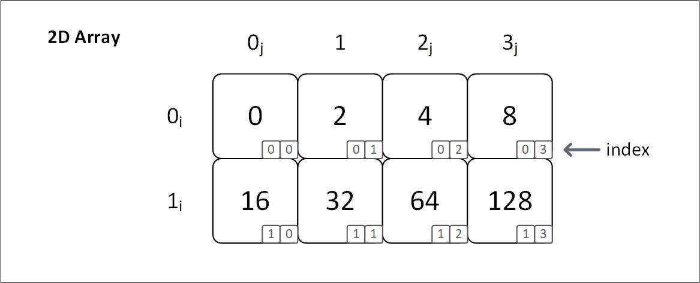

# Primitive Type
In rust, primitive data types are those, which are built in and do not need any library to be used.[^1] 

For instance, signed integers (`i8`, `i32`, `isize`, ...), floating point (`f32`, `f64`), char, etc are *scalar primitive types* as they hold only single values.

On the other hand arrays and tuples are called *compound primitive types* because they hold multiple values.


## Initializing an array {#initializing-an-array}
```rust
{{#include ./arrays.rs:initialize}}
```

## Defining an array
We can specify type and length in the format of `[T; N]`, where:<br>
`T`: Element Type<br>
`N`: Size (it is constant and it should be non-negative)
```rust
{{#include ./arrays.rs:quantify}}
```

We can also repeat values by specifying a value to repeat and the number of times to repeat it<br>
`[E; N]`<br>
`E`: Expression<br>
`N`: Number of times to repeat
```rust
{{#include ./arrays.rs:repeat}}
```

## Accessing and modifying an array
We can access array elements using their index, and modify the values provided the array is mutable.
```rust
{{#include ./arrays.rs:access_one_array_element}}
```

## Advantages and Disadvantages of Arrays
| **Advantages** | **Disadvantages** |
| --- | --- |
| Accessing / searching for elements is fast. | Fixed size |
| Can represent multiple elements using single name. | Memory wastage |
| Traversal is easy | Insertion and deletion is difficult |
| Continuous memory allocation | Sorting is difficult |

## Types of Array:
### 1. 1D array: 
One dimensional array refers to an array that contains only a row of elements. A 1D array can be accessed by using a single index.


**Initializing a 1D array**: Arrays are one dimensional by default. When you initialize an array, like you did [at the start](#initializing-an-array), you are initializing a 1D array. 	

**Use Case**: 1D arrays are used when we have to store similar items contiguously. These items are related in some way.

### 2D array:
Two Dimensional array refers to an array that contains rows as well as columns of element. A 2D array can be accessed by using two indices; one index specifying the row, the other specifying the column.



> Notice that the 1D array and 2D array figures have the same 8 elements. The only difference is how they are accessed. 
> 
> We use only one index to access 4 from 1D: `array[2]`.
> On the other hand, we have to use two two values to access 4 from 2D: `array[0][2]`.
>
> In 2D array, we are actually storing arrays in a sequential order, i.e. we are storing an array of arrays. The first index specifies which array we want to access, (`0i`, `1i`), then we specify which element from that array we want to specify, (`0j`, `1j`, `2j`, `3j`).

**Initializing a 2D array**: While arrays are stored in a single line, they are ideal for a One dimensional relationship. But in some cases you need to store elements that have a Two dimensional relationship. To structure that data in such a way, this is how we do it:
```rust
{{#include ./arrays.rs:2D_array}}
```

[^1]: <https://doc.rust-lang.org/rust-by-example/primitives.html>